# Scan Organizer - System Overview

## Architecture Diagram

```mermaid
graph TB
    Start([PDF File]) --> Drop[Drag & Drop to App]

    Drop --> Queue[ProcessingQueue]
    Queue --> Check{File in Queue?}
    Check -->|No| Add[Create QueueItem]
    Check -->|Yes| Skip[Skip]

    Add --> Process[PDFProcessor.process]

    Process --> Step1[1. Apple Vision OCR<br/>OCRService.extractText]
    Step1 --> OCR1[Extract text with VNRecognizeTextRequest]

    OCR1 --> Step2[2. OCR Comparison<br/>OCRComparisonService.compareOCR]
    Step2 --> Compare{Compare Scores}
    Compare --> ExistingOCR[Existing OCR<br/>from PDF extraction]
    Compare --> AppleOCR[Apple Vision OCR<br/>Calculate score]
    Compare --> SelectBest[Select best text<br/>based on score]

    SelectBest --> Step3[3. PDF to Image<br/>extractFirstPageImage]
    Step3 --> Render[First page as PNG<br/>2x scaling]

    Render --> Step4[4. Vision AI Analysis<br/>LoggingAIClassifier]
    Step4 --> VisionAI[callVisionAIWithLogging]
    VisionAI --> FindModel[findAvailableVisionModel<br/>granite3.2-vision:2b]
    FindModel --> VisionPrompt[Vision Prompt:<br/>- Base64 Image<br/>- OCR Text Excerpt 800 chars<br/>- Ask for language & type]
    VisionPrompt --> OllamaVision[Ollama API /generate<br/>with image]

    OllamaVision --> VisionResponse[Vision Response:<br/>LANGUAGE: GERMAN/ENGLISH<br/>Document type<br/>Title<br/>Purpose]

    VisionResponse --> ExtractLang[extractLanguage from Response]

    ExtractLang --> Step5[5. Text AI Processing<br/>callTextAIWithLogging]
    Step5 --> TextPrompt[Text Prompt:<br/>- Vision Description<br/>- OCR Text 1500 chars<br/>- File date fallback<br/>- Language<br/>- JSON Schema]
    TextPrompt --> OllamaText[Ollama API /generate<br/>granite3.3:2b]

    OllamaText --> TextResponse[JSON Response:<br/>date, title, type,<br/>components array]

    TextResponse --> ParseJSON[parseAIComponentsWithLogging<br/>Extract & validate JSON]

    ParseJSON --> BuildName[buildFileName from components:<br/>YYYY-MM-DD_Type_Title.pdf]

    BuildName --> Step6[6. File organization<br/>FileOrganizer.file]
    Step6 --> CreateDir[Create directory structure:<br/>~/Documents/ScanOrganizer/Year/Type/]
    CreateDir --> MoveFile[Move PDF<br/>with new name]

    MoveFile --> Result[ProcessingResult]
    Result --> UpdateUI[GUI Update:<br/>- Status: Completed ✓<br/>- Show log<br/>- Confidence %<br/>- New filename]

    UpdateUI --> End([Done])

    style Step1 fill:#e1f5fe
    style Step2 fill:#fff3e0
    style Step3 fill:#f3e5f5
    style Step4 fill:#e8f5e9
    style Step5 fill:#fce4ec
    style Step6 fill:#fff8e1

    classDef aiStep fill:#c8e6c9
    class VisionAI,OllamaVision,OllamaText aiStep
```



## Processing Pipeline

### 1. Input & Queue Management
- **Drag & Drop**: PDFs can be dragged onto app icon or window
- **ProcessingQueue**: Sequential processing with status tracking
- **QueueItem**: Stores file URL, status, progress and log

### 2. OCR Processing
- **Apple Vision Framework**: Modern OCR with VNRecognizeTextRequest
- **OCR Comparison**: Compares existing PDF OCR with Apple Vision
- **Score-based Selection**: Selects better text based on quality score

### 3. AI Classification Pipeline
- **Vision AI (granite3.2-vision:2b)**:
  - Analyzes first PDF page as image
  - Detects document language (GERMAN/ENGLISH)
  - Identifies document type and main purpose

- **Text AI (granite3.3:2b)**:
  - Extracts structured data
  - Generates JSON with: date, title, type, components
  - Normalizes title in detected language
  - Evaluates component importance (confidence)

### 4. File Organization
- **Filename Generation**: YYYY-MM-DD_Type_Title.pdf
- **Directory Structure**: ~/Documents/ScanOrganizer/Year/Type/
- **Automatic Filing**: Moves and renames PDFs automatically

### 5. User Interface
- **Queue List**: Shows all PDFs with status icons
- **Active Highlighting**: Blue border for current file
- **Processing Log**: Real-time log with AI prompts and responses
- **Auto-scroll**: Log scrolls automatically to newest entry

## Key Components

### Core Services
- `PDFProcessor`: Main processing pipeline with ProcessingDelegate
- `OCRService`: Apple Vision Framework integration
- `OCRComparisonService`: OCR quality comparison
- `AIClassifier`: Ollama AI integration (Vision + Text)
- `LoggingAIClassifier`: Extended version with detailed logging
- `FileOrganizer`: File organization and renaming

### Queue System
- `ProcessingQueue`: Queue management with continuous processing
- `QueueItem`: Observable object with status and progress
- `DirectoryMonitor`: Monitors directory for new PDFs

### GUI Components
- `ContentView`: Main split view with queue and details
- `QueueListView`: List with drag & drop support
- `ItemDetailView`: Shows processing details and log
- `QueueItemRow`: Rows with status animation

## Status Flow
```
pending → processing → completed/failed
```

## Logging System
- **ProcessingDelegate Protocol**: Interface for status updates
- **updateStatus**: Shows current step with progress
- **addLogEntry**: Adds detailed log entries
- **Real-time Updates**: All changes immediately visible in GUI

## AI Models Required
1. **granite3.2-vision:2b** - For image analysis
2. **granite3.3:2b** - For text processing

## Installation Path
```
/Applications/Scan Organizer.app
```
